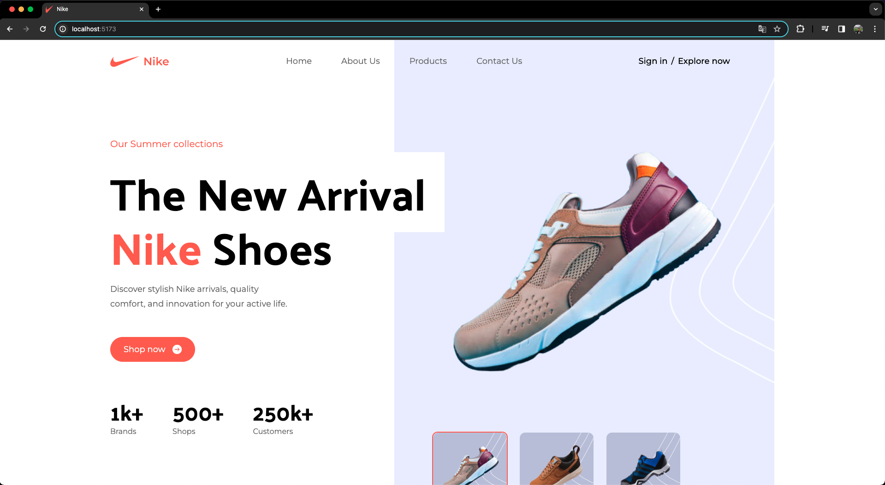

markdown
Copy code
# Nike Website Clone

This is a project to clone the Nike website for practice and learning purposes. The project was built using React, Tailwind CSS, and deployed online.

## Preview

You can view the cloned website online [here](https://your-link-here.com).

## Features Implemented

- Responsive navigation, including a hamburger menu for mobile devices.
- Product pages, including product details and purchase options.
- Functional shopping cart, with the ability to add and remove items.
- Checkout pages to complete the purchase.
- Integration with payment API to process transactions.

## Technologies Used

- React
- Tailwind CSS
- JavaScript
- Payment API (e.g., Stripe, PayPal, etc.)

## How to Run Locally

1. Clone the repository to your development environment:

```bash
git clone https://github.com/your-username/nike-clone.git
Navigate to the project directory:
bash
Copy code
cd nike-clone
Install the dependencies:
bash
Copy code
npm install
Start the development server:
bash
Copy code
npm start
Open your web browser and navigate to http://localhost:3000.
Contributions
Contributions are welcome! If you find issues or want to add new features, feel free to open an issue or send a pull request.

License
This project is licensed under the MIT License. See the LICENSE file for more details.

sql
Copy code

Ensure you replace placeholders like "your-link-here.com" and "your-username" with your actual links and information.


Message ChatGPT…

